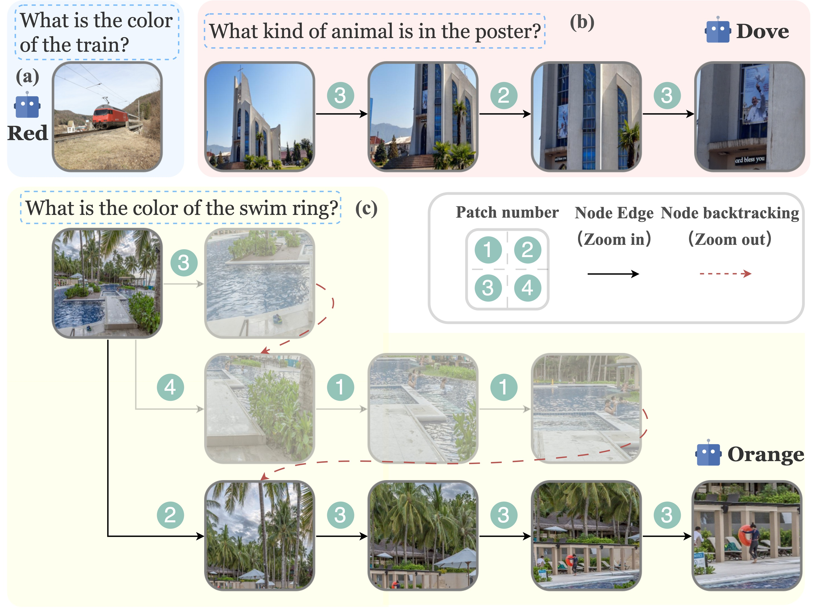

# 🔍 ZoomEye: Enhancing Multimodal LLMs with Human-Like Zooming Capabilities through Tree-Based Image Exploration

<font size=4><div align='center' > [[🍎 Project](https://szhanz.github.io/zoomeye/)] [[📖 Paper](https://arxiv.org/abs/2411.16044)] [[🤗 Data](https://huggingface.co/datasets/omlab/zoom_eye_data)] </div></font>

<p align="center">  </p>

Most visual existing reasoning approaches remain text-level in nature (**left of the above figure**): MLLMs are prompted to explore various combinations of textual tokens via their underlying language model, while the visual input remains fixed throughout the reasoning process. This paradigm limits the model’s ability to fully exploit rich visual information, particularly when dealing with images containing numerous fine-grained elements. In such cases,
vision-level reasoning becomes crucial—where models dynamically zoom into specific regions of the image to gather detailed visual cues necessary for accurate decision-making (**right of the above figure**). 


<p align="center">  </p>


Zoom Eye enables MLLMs to **(a)** answer the question directly when the visual information is adequate, **(b)** zoom in gradually for a closer examination, and **(c)** zoom out to the previous view and explore other regions if the desired information is not initially found.

## 📜  Updates
* **`2025.11.19`** 🌟 We have released the code of [InternVL2.5-ZoomEye](ZoomEye/zoom_model_internvl.py) and [Qwen2.5-VL-ZoomEye](ZoomEye/zoom_model_qwenvl.py), welcome to try them! 
* **`2025.08.28`** 🌟 We have released an [updated version of our paper](https://arxiv.org/pdf/2411.16044v3) on arXiv, which includes the results of Qwen2.5-VL and InternVL2.5, along with a thorough comparison against a wide range of baselines.
* **`2025.08.21`** 🌟  Zoom Eye has been accepted by EMNLP 2025 MainConference 🎉. We will release an updated version of the paper soon, which includes more comprehensive evaluations on various Multimodal Large Language Models (MLLMs) as well as a detailed ablation study. Stay tuned ~
* **`2025.01.01`** 🌟  We released the [Project Page](https://szhanz.github.io/zoomeye/) of ZoomEye, welcom to visit~
* **`2025.01.01`** 🌟  We released the evaluation code for MME-RealWorld.
* **`2024.11.30`** 🌟  We released the evaluation code for V<sup>*</sup> Bench and HR-Bench.
* **`2024.11.25`** 🌟  We released the [ArXiv paper](https://arxiv.org/abs/2411.16044).

## 🛠️ Installation
This project is built based on [LLaVA-Next](https://github.com/LLaVA-VL/LLaVA-NeXT). If you encounter unknown errors during installation, you can refer to the issues and solutions in it.

### 1. Clone this repository
```bash
git clone https://github.com/om-ai-lab/ZoomEye.git
cd ZoomEye
```
### 2. Install dependencies
```bash
conda create -n zoom_eye python=3.10 -y
conda activate zoom_eye
pip install --upgrade pip  # Enable PEP 660 support.
pip install -e ".[train]"
pip install -r requirements.txt
```

## 📚 Preparation
### 1. MLLM checkpoints
In our work, we implement Zoom Eye with LLaVA-v1.5, LLaVA-OneVision(ov), InternVL2.5, and Qwen2.5-VL series, you could download these checkpoints before running or automatically download them when executing the **from_pretrained** method in transformers.
* [LLaVA-v1.5-7B](https://huggingface.co/liuhaotian/llava-v1.5-7b)
* [LLaVA-v1.5-13B](https://huggingface.co/liuhaotian/llava-v1.5-13b)
* [LLaVA-ov-0.5B](https://huggingface.co/lmms-lab/llava-onevision-qwen2-0.5b-ov)
* [LLaVA-ov-7B](https://huggingface.co/lmms-lab/llava-onevision-qwen2-7b-ov)
* [InternVL2.5-4B](https://huggingface.co/OpenGVLab/InternVL2_5-4B)
* [InternVL2.5-8B](https://huggingface.co/OpenGVLab/InternVL2_5-8B)
* [Qwen2.5-VL-3B](https://huggingface.co/Qwen/Qwen2.5-VL-3B-Instruct)

### 2. Evaluation data
The core evaluation data (including V<sup>*</sup> Bench and HR-Bench) will be used has been packaged together, and the link is provided [here](https://huggingface.co/datasets/omlab/zoom_eye_data). After downloading, please unzip it and its path is referred as to **anno path**.

**[Optional]** If you want to evaluate ZoomEye on MME-RealWorld Benchmark, you could follow the instructions in [this repository](https://github.com/yfzhang114/MME-RealWorld) to download the images and extract them to the \<anno path\>/mme-realworld directory. Meanwhile, place the *annotation_mme-realworld.json* file from [this link](https://huggingface.co/datasets/omlab/zoom_eye_data) into \<anno path\>/mme-realworld.

The folder tree is that:
```
zoom_eye_data 
  ├── hr-bench_4k                                  
  │   └── annotation_hr-bench_4k.json
  │   └── images/
  │     └── some.jpg
  │    ...
  ├── hr-bench_8k
  │   └── annotation_hr-bench_8k.json
  │   └── images/
  │     └── some.jpg
  │    ...
  │── vstar
  │   └── annotation_vstar.json
  │   └── direct_attributes/
  │     └── some.jpg
  │    ...
  │   └── relative_positions/
  │     └── some.jpg
  │    ...
  ├── mme-realworld
  │   └── annotation_mme-realworld.json
  │   └── AutonomousDriving/
  │   └── MME-HD-CN/
  │   └── monitoring_images/
  │   └── ocr_cc/
  │   └── remote_sensing/
 ...
```


## 🚀 Evaluation
### 1. Run the demo
We provide a demo file of Zoom Eye accepting any input Image-Question pair.
```bash
python ZoomEye/demo.py \
    --model-path lmms-lab/llava-onevision-qwen2-7b-ov \
    --input_image demo/demo.jpg \
    --question "What is the color of the soda can?"
```
and the zoomed views of Zoom Eye will be saved into the demo folder.

### 2. Run the Gradio Demo
We also provide a Gradio Demo, run the script and open http://127.0.0.1:7860/ in your browser.
```bash
python demo_gradio.py 
```

### 3. Results of V<sup>*</sup> Bench
```bash
# After excute this script, the result will be saved in the answers dir: ZoomEye/eval/answers/vstar/<mllm model base name>/merge.jsonl
# <mllm model> could be "Qwen/Qwen2.5-VL-3B-Instruct"(huggingface tag) or "/mnt/shz/ckpt/InternVL2_5-8B"(local path)
CUDA_VISIBLE_DEVICES=0,1,2,3,4,5,6,7 bash ZoomEye/eval/perform_zoom_eye.sh \
<mllm model> \
<anno path> \
vstar

# Get the result
python ZoomEye/eval/eval_results_vstar.py --answers-file ZoomEye/eval/answers/vstar/<mllm model base name>/merge.jsonl
```
The \<mllm model\> could be referred as to the above MLLM checkpoints, and the \<anno path\> is the path of the evaluation data.

If you don't have multi-gpu environment, you can set CUDA_VISIBLE_DEVICES=0.

### 4. Results of HR-Bench 4k
```bash
# After excute this script, the result will be saved in the answers dir: ZoomEye/eval/answers/hr-bench_4k/<mllm model base name>/merge.jsonl
CUDA_VISIBLE_DEVICES=0,1,2,3,4,5,6,7 bash ZoomEye/eval/perform_zoom_eye.sh \
<mllm model> \
<anno path> \
hr-bench_4k

# Get the result
python ZoomEye/eval/eval_results_hr-bench.py --answers-file ZoomEye/eval/answers/vstar/hr-bench_4k/merge.jsonl
```


### 5. Results of HR-Bench 8k
```bash
# After excute this script, the result will be saved in the answers dir: ZoomEye/eval/answers/hr-bench_8k/<mllm model base name>/merge.jsonl
CUDA_VISIBLE_DEVICES=0,1,2,3,4,5,6,7 bash ZoomEye/eval/perform_zoom_eye.sh \
<mllm model> \
<anno path> \
hr-bench_8k

# Get the result
python ZoomEye/eval/eval_results_hr-bench.py --answers-file ZoomEye/eval/answers/vstar/hr-bench_8k/merge.jsonl
```

### 6. Results for MLLMs with direct answering
```bash
# After excute this script, the result will be saved in the answers dir: ZoomEye/eval/answers/<bench name>/<mllm model base name>/direct_answer.jsonl
python ZoomEye/eval/perform_zoom_eye.py \
    --model-path <mllm model> \
    --annotation_path <anno path> \
    --benchmark <bench name> \
    --direct-answer

# Get the result
python ZoomEye/eval/eval_results_{vstar/hr-bench}.py --answers-file ZoomEye/eval/answers/<bench name>/<mllm model base name>/direct_answer.jsonl
```

### 7. Results of MME-RealWorld
```bash
# After excute this script, the result will be saved in the answers dir: ZoomEye/eval/answers/mme-realworld/<mllm model base name>/merge.jsonl
CUDA_VISIBLE_DEVICES=0,1,2,3,4,5,6,7 bash ZoomEye/eval/perform_zoom_eye.sh \
<mllm model> \
<anno path> \
mme-realworld

# Get the result
python ZoomEye/eval/eval_results_mme-realworld.py --answers-file ZoomEye/eval/answers/vstar/hr-bench_8k/merge.jsonl
```

## 🔗 Related works
If you are intrigued by multimodal large language models, and agent technologies, we invite you to delve deeper into our research endeavors:  
🔆 [OmAgent: A Multi-modal Agent Framework for Complex Video Understanding with Task Divide-and-Conquer](https://arxiv.org/abs/2406.16620) (EMNLP24)   
🏠 [GitHub Repository](https://github.com/om-ai-lab/OmAgent)

🔆 [How to Evaluate the Generalization of Detection? A Benchmark for Comprehensive Open-Vocabulary Detection](https://arxiv.org/abs/2308.13177) (AAAI24)   
🏠 [GitHub Repository](https://github.com/om-ai-lab/OVDEval/tree/main)

🔆 [OmDet: Large-scale vision-language multi-dataset pre-training with multimodal detection network](https://ietresearch.onlinelibrary.wiley.com/doi/full/10.1049/cvi2.12268) (IET Computer Vision)  
🏠 [Github Repository](https://github.com/om-ai-lab/OmDet)

## ⭐️ Citation

If you find this repository helpful to your research, welcome to cite our paper:  
```angular2
@article{shen2024zoomeye,
  title={ZoomEye: Enhancing Multimodal LLMs with Human-Like Zooming Capabilities through Tree-Based Image Exploration},
  author={Shen, Haozhan and Zhao, Kangjia and Zhao, Tiancheng and Xu, Ruochen and Zhang, Zilun and Zhu, Mingwei and Yin, Jianwei},
  journal={arXiv preprint arXiv:2411.16044},
  year={2024}
}
```